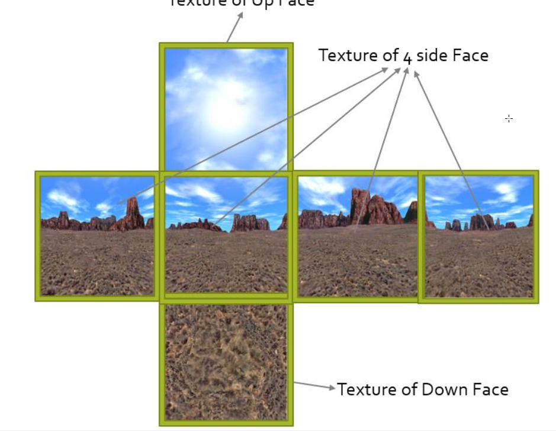
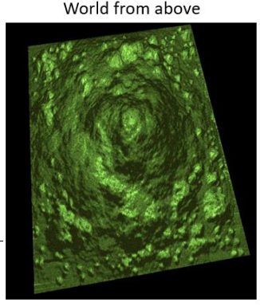

# Natural-Scene-Simulation-using-Opengl-

<h1>  BRIEF DESCRIPTION  </h1>
 

 

 
The simulation of natural scenes is a very important branch of
Computer Graphics and has broad application fields. The main
idea is to simulate a real-world natural scene, by drawing island,
trees, grass and simulate the daylight, water movement and surround the world with a realistic skybox and some special effects like: fog, snow falling, … etc.

<h1> REQUIREMENTS</h1>
<h2 > [SkyBox]</h2>

Draw a skybox with a realistic 6 textures one for each face of the cube.
<h2>[Terrain]</h2>
Given any height map draw a multi-texture terrain to simulate the island.
<h2> [Light]</h2> Simulate both the day and night light.
<h2> [Trees and Grass]</h2>
Draw 3D tree models in random locations of the terrain and draw
billboards with grass texture in different locations.
<h2> [Water] </h2> Simulate the sea motion.
<h2> [Special effect]</h2> Apply Fog effect.
<h2> [Camera]</h2>
Implement First Person Camera that can walk on the surface of the
terrain accurately.
<h2> [Tour]</h2>
By pressing a certain key, allow the camera to take a tour around the
scene automatically.
BONUS
<h2> [Sound effect]</h2>
 add sound the simulate the sound of beach & water.
<h2> [Special effects]</h2>
 add much complicated effects like snow, rain, … etc.
<h2> [Water effect] </h2> add reflection & refraction to water.
[Save & Load Scene] add option to save an entire scene and loading it.
<h2> [Human] </h2> add animated 3D human model and implement 3rd person
camera to follow the human in the scene.
 
***
<h1  >Detailed Description: </h1>
<h2>SKYBOX</h2>
• To make the world appears more realistic, we need to draw a “SkyBox”.
 
• Sky box is a very big cube that surround the whole world, with a different texture on each face,
 
for example: 
– Up face has the texture of sky. 
– Down face has texture of ground. 
– The other 4 faces have a side texture. 
• When you look at it from inside, it looks so realistic better than that black space. 

 

 
<h2> TERRAIN</h2> 
• To draw a more realistic island, use Terrain. 
• What is Terrain? 
– Using the same previous concept but build the world based on image not text file. 
– This image called “Height Map” a gray scale image where the gray value of each pixel defines the height in the world. 
– Imagine as if you are looking on island from above. 
– Dark gray means low heights (ground), bright gray means high heights (mountains). 

 
<h3> How to draw a terrain “given a grayscale image (Height Map)”?</h3>
– Open the image using (Bitmap) class in C# in namespace “System.Drawing”. 
– Any image is a 2D array of pixels, simply loop on the image pixel by pixel. 
– For each pixel, take a window of size 2x2 (i.e. at pixel with index (i,j), take (i+1,j), (i,j+1) & (i+1,j+1) the 3 neighbors of
pixel (i,j)). 
– Given the 4 pixels create 4 vertices, vertex corresponding for each pixel. 
– Let i be the X value of vertex, j the Z value and finally the color of pixel is the Y value. 
– These 4 vertices are then used to draw 2 triangles. 
– Compute the normal for each triangle using the equation explained in light lab. 
– Add “U, V” data for each vertex. 
– Control the scale of the terrain in width, height & depth using scale matrix 

 

– Given the 4 pixels create 4 vertices, vertex corresponding for each pixel. 
– Let i be the X value of vertex, j the Z value and finally the color of pixel is the Y value. 
– These 4 vertices are then used to draw 2 triangles. 
– Compute the normal for each triangle using the equation explained in light lab. 
– Add “U, V” data for each vertex. 
– Control the scale of the terrain in width, height & depth using scale matrix 
<h3> Multi-Texture Terrain</h3>
- Multi-Texture terrain is more realistic than single texture terrain 
- Let’s say we have 4 textures (Sand, Grass, Rock, Ice). 
- Send all 4 textures to fragment shader and the position of the current vertex, the fragment shader should decide which 
texture to use based on the height of the vertex. Let’s first normalize the value of Y of the vertex by dividing it by the
maximum height, this will produce a value for Y ranged from 0~1 in each vertex.
- If Y ranged from: 
o 0~0.25 then use Sand Texture. 
o 0.25~0.5 then use Grass Texture. 
o 0.5~0.75 then use Rock Texture. 
o 0.75~1 then use Ice Texture 
- To make the transition from texture to another smooth the function mix (color1, color2, mixFactor).
<h2> TREE </h2>  
- Trees are a static 3D model. 
- Draw it in random location of the terrain but take care of the height of this location.

 

-<h2>  GRASS </h2>  
Grass can be rendered as a <u> <b> billboard </b></u> instead of 3D model to reduce computations done by drawing 3D models. 

  

A <u> <b> billboard </b></u>  is a flat object, usually a quad (square) in a 3D space, and can be done as follows: 
• First draw a quad (2 triangles). 
• Load Texture and apply it on the quad. 
• Then draw it in a certain position in the 3D world.
<h2> WATER </h2>
• Draw a 2D grid of squares (the same way we created the terrain consists of multiple squares, the only difference is that all
squares in water initially have the same Y = 0). 
• Add water texture, UV data & compute normal. 
• In vertexshader, manipulate y (height) of each vertex using this equation: 
o Vertex.y += (sin (Time*Vertex.x) + cos (Time * Vertex.z)) * waveAmplitude; 
o Time is a float variable that increase with time in Renderer and then sent to VertexShader, wave amplitude is the
height of water wave. 
• In fragmentshader, manipulate the alpha color component 
o out vec4 color; 
o In the end of fragmentshader: color.a = 0.5; //to make the 2D grid half transparent 
• Note: Blending must be enabled to allow the transparency 
• To enable Transparency: 
<h2> FOG</h2> 
• Adds more realism to scene. 
• Fog density increase as the distance increase.• To apply Fog, we need to send view matrix to vertex  shader and pass viewspace = V*M*vertex to fragment shader (where V is
view matrix and M is model matrix and vertex is the vertex position). 
• In fragmentshader: 
– Define the fog color as vec3, fog density as a float value (ex: 0.05). 
– float dist = length(viewspace); //the distance of vertex from camera position 
– Apply fog equation such that attenuation is the fog density. 
– fogFactor = clamp( fogFactor, 0.0, 1.0 ); 
– color = mix(fogColor, color, fogFactor); //interpolate between color and fogcolor with fogfactor ratio. 
<h2> TOUR</h2>
• Generate Random N points on the terrain. 
• For each point, move the camera from point(i) to point(i+1). 
• The motion should be smooth steps (i.e. don’t make the camera disappear from point(i) and appear at point(i+1) instantly). 
• Camera should move on its own (i.e. without any keypress) until the tour ends. 
• Camera should move on its own (i.e. without any keypress) until the tour ends. 
<h1 >⚡ Demo ⚡ </h1>

 
